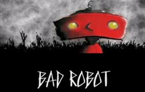
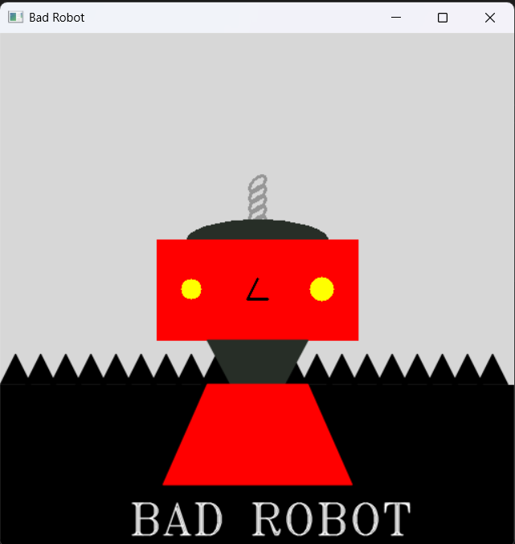

# **Practica 1: Herramientas de Dibujo**

**Asignatura:** Inteligencia Artificial  
**Carrera:** Ingeniero en Sistemas Computacionales (ISC) 8°  
**Lenguaje:** Python 3.14.2

---

## **Descripción**

`bad_robot.py` es un programa que dibuja un robot llamado **"Bad Robot"** usando exclusivamente primitivas gráficas de la librería OpenCV, aplicando conceptos como:

- Creación y manipulación de lienzos con NumPy.
- Dibujo de figuras geométricas (rectángulos, círculos, elipses).
- Uso de polígonos y polilíneas.
- Iteración con bucles para generar patrones repetitivos.
- Renderizado de texto en imágenes.

---

## **Ambiente Virtual**

### ¿Cómo crear y activar el ambiente virtual?

### **1. Crear el ambiente virtual**

```bash
python -m venv .venv
```

### **2. Activar el entorno**

#### **Windows (PowerShell)**

```bash
.venv\Scripts\activate.ps1
```

#### **Windows (cmd)**

```bash
.venv\Scripts\activate.bat
```

#### **Linux/Mac**

```bash
source .venv/bin/activate
```

### **3. Actualizar PIP**

```bash
python -m pip install --upgrade pip
```

---

## **Instalación**

### **1. Descarga y descomprime el proyecto**

Extraer el proyecto y entrar a la carpeta:

```bash
cd bad_robot
```

### **2. Activa el entorno virtual**

```bash
.venv\Scripts\activate
```

### **3. Instalar dependencias**

```bash
pip install -r requirements.txt
```

Esto instala automáticamente todo lo necesario (`numpy` y `opencv-python`).

### **4. Ejecutar el programa**

```bash
python bad_robot.py
```

Se abrirá una ventana con el robot dibujado. Presiona cualquier tecla para cerrarla.

---

## **Dependencias**

Las librerías usadas en este proyecto son:

```bash
numpy
opencv-python
```

Se pueden instalar manualmente con:

```bash
pip install numpy opencv-python
```

---

## **Estructura del Proyecto**

```bash
bad_robot/
│
├── bad_robot.py        # Archivo principal con todo el código
├── requirements.txt    # Dependencias del proyecto
└── README.md           # Este archivo
```

---

## **¿Qué dibuja el programa?**

El robot está compuesto por las siguientes partes, cada una construida con primitivas de OpenCV:

| Parte        | Figura usada              |
|--------------|---------------------------|
| Cielo        | Rectángulo gris           |
| Césped       | Triángulos repetidos      |
|Antena/resorte| Elipses inclinadas        |
| Casco        | Semicírculo (elipse)      |
| Cabeza       | Rectángulo rojo           |
| Ojos         | Circulos amarillos        |
| Nariz        | Polilínea triangular      |
| Cuello       | Triángulo                 |
| Cuerpo       | Trapecio (polígono)       |
| Texto        | `cv2.putText()`           |

---

## **Explicación del código**

### **Lienzo**

Se crea un arreglo NumPy de ceros de 512x512x3 que representa la imagen en blanco (negro) donde se dibuja todo.

```python
canvas = np.zeros((512, 512, 3), dtype="uint8")
```

### **Césped (bucle)**

Se usa un bucle `for` para repetir un triángulo base desplazándolo horizontalmente en cada iteración.

```python
for i in range(num_trangulos):
    tgr_x = i * separacion_trg
    puntos_triangulo = puntos_cesped + [tgr_x, 0]
```

### **Resorte/Antena (bucle)**

Se dibujan varias elipses inclinadas subiendo en el eje Y para simular una espiral.

```python
for i in range(num_aros):
    aro_y = inicio_y - i * separacion_aro
    cv2.ellipse(canvas, (inicio_x, aro_y), (10,5), 135, 0, 360, (150, 150, 150), 2)
```

### **Visualización**

Al final se muestra la ventana y se espera a que el usuario presione una tecla.

```python
cv2.imshow(window_name, canvas)
cv2.waitKey(0)
cv2.destroyAllWindows()
```

---

## **Evidencia**

Se incluyen capturas de pantalla del programa en ejecución:

> ### Robot original



> ### Robot creado



---

## **Conclusión**

Este proyecto aplica los fundamentos del manejo de imágenes con OpenCV, usando únicamente primitivas gráficas para construir una figura compleja. Sirve como introducción al procesamiento de imágenes y a la lógica de coordenadas en píxeles, base para futuros proyectos de visión computacional.
